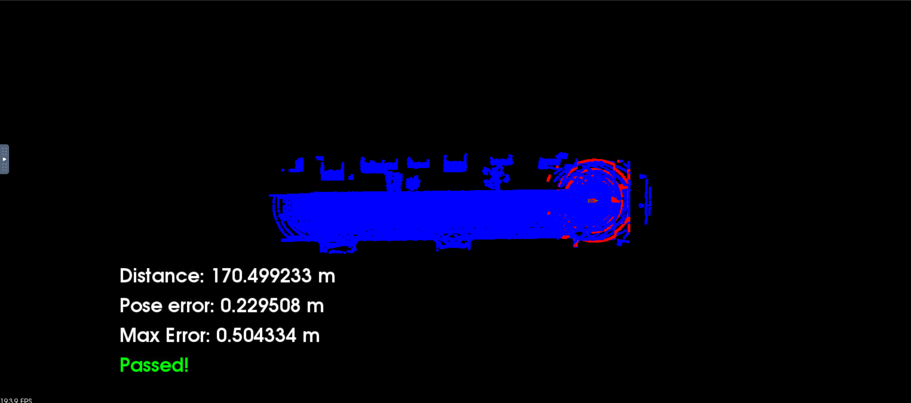

# nd013-c3-localisation-starter

This project is finished in workspace VM.


## Usage

GPU must be enabled and we have to use remote desktop for visualization.

To run the Carla simulator by using following commands:

```
su - student # Ignore outout for permission Denied
cd /home/workspace/c3-project
./run_carla.sh
```

Start another terminal if we use terminator, press Ctrl + Shift + e 
```
cd /home/workspace/c3-project
cmake .
make
```

Run the executable program:

```
./cloud_loc
```

## Result

### Using ICP algorithm


### Using NDT algorithm


Remark:
There are still lots of things to optimize.
